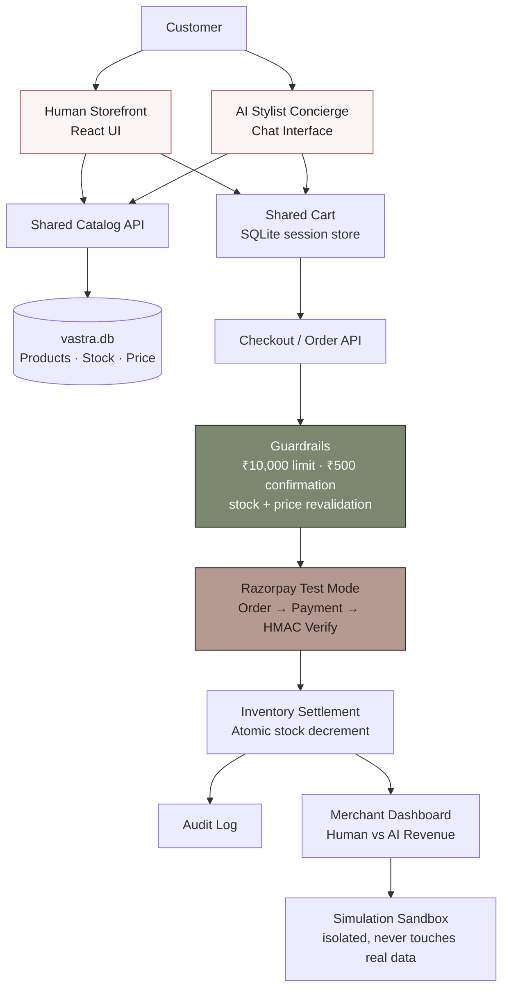
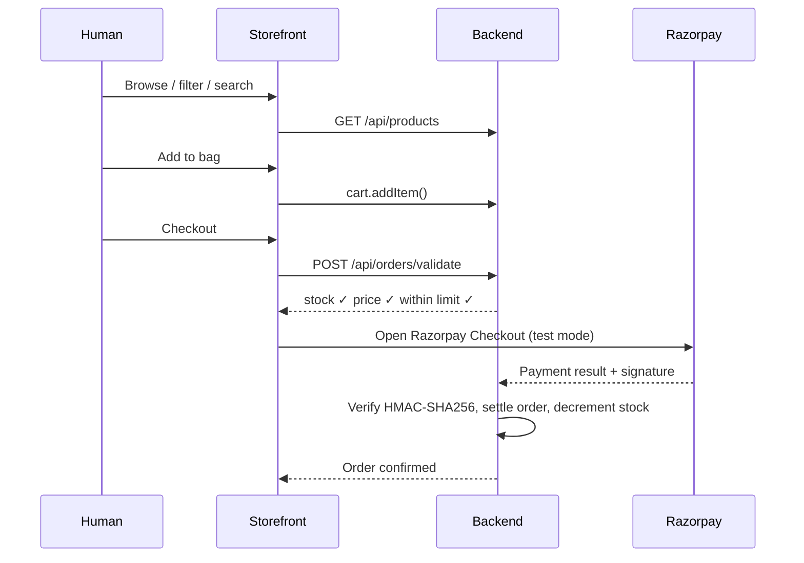
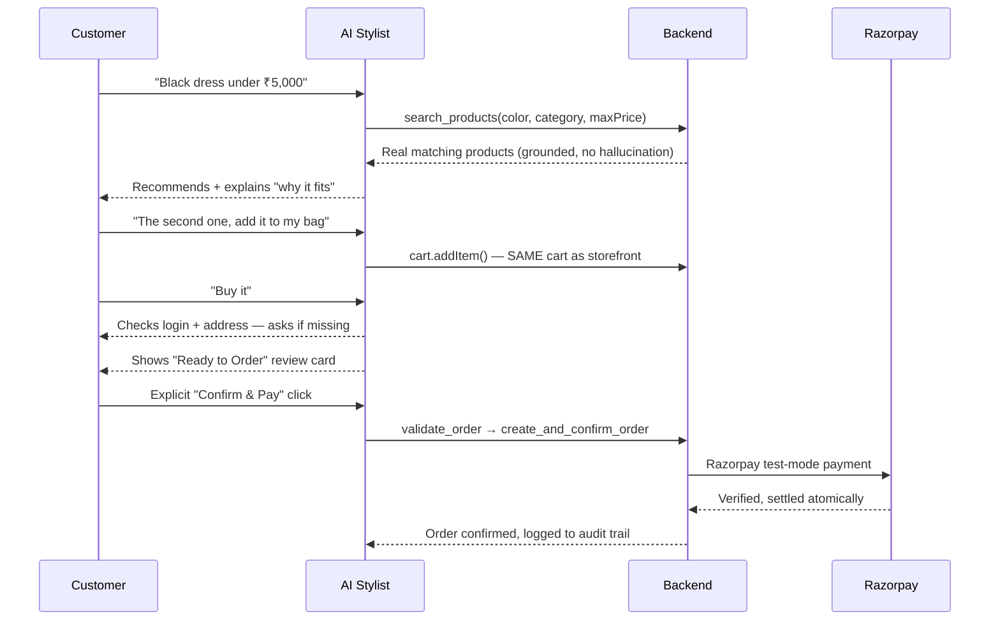

# Vastra.AI - *Fashion, found intelligently.*

Built for **Track 01: AI Growth & Agentic Commerce**

---
## 🔗 Live Demo

### 🌐 Vastra.AI — Live Website
👉 https://vastra-ai-swart.vercel.app

### ⚙️ Backend API
👉 https://vastraai-production-6c12.up.railway.app/api/health

## The One-Line Pitch

Vastra.AI is a premium fashion storefront where the **exact same backend** — catalog, cart, checkout, guardrails — serves a human clicking through a website *and* an AI shopping agent chatting with a customer, proving that a merchant's commerce infrastructure can become AI-transactable without building a second, separate system.

---

## Built for the Razorpay AI Buildathon — Track 01

**Track 01: AI Growth & Agentic Commerce** asks a direct question: can a merchant grow revenue by becoming transactable by an AI buyer — not just a human one — on Razorpay's payment rails, with every money action explainable, bounded, and gated?

**The problem:** e-commerce today is built for one kind of buyer — a human clicking through pages. AI shopping agents are emerging as a second kind of buyer, but most merchants have no real way to let an AI browse their actual catalog and complete an actual purchase on a customer's behalf, with the same trust and safety guarantees a normal checkout has. Bolting a chatbot onto a website isn't the same as making a merchant genuinely AI-transactable.

**The solution:** Vastra.AI is one merchant's commerce backend — catalog, cart, checkout, and guardrails — exposed through two front doors: a normal storefront for human shoppers, and a conversational AI stylist for AI-driven shopping. Both run through the same Razorpay Test Mode payment flow, the same spending guardrails, and the same audit trail, proving that one piece of commerce infrastructure can safely serve both kinds of buyers at once.

---

## The Shift This Project Is About

Traditional e-commerce is built for one kind of shopper:

```
Search → Filter → Browse → Compare → Decide → Buy
```

An AI buyer doesn't work that way. It works from intent:

```
Intent → Understand → Curate → Confirm → Buy
```

Most merchants today have no way to let an AI agent genuinely browse their real catalog and complete a real purchase on a customer's behalf — with the same trust and safety guarantees a human checkout has. Vastra.AI is built to answer that gap directly, not with a chatbot bolted onto a website, but with one commerce backend that both kinds of buyers can transact through.

## The Idea

Vastra.AI gives one merchant **two front doors into the same commerce engine**:

- 🛍️ A **human storefront** — browse, filter, add to bag, checkout normally
- 💬 An **AI stylist concierge** — describe what you want in plain language, get real recommendations, refine, and check out conversationally

Both talk to the **same catalog, the same cart, the same checkout, and the same guardrails.** Neither has its own separate logic. If a human adds something to their bag, the AI sees it instantly. If the AI adds something, it shows up in the cart drawer the human sees.

## Why This Is Different

Most "AI shopping" demos are one of two things:
1. A chatbot bolted onto a normal website, with its own disconnected logic, or
2. A pure chat interface with no real storefront behind it

Vastra.AI is neither. It's **one real commerce backend**, exposed through two clients — proving a merchant doesn't need to rebuild their business to become AI-ready; they just need their existing commerce infrastructure to speak an AI-callable "language" (structured tools) instead of only HTML pages.

---

## Architecture



**The one rule that makes this work:** the frontend is never the source of truth for price, stock, or payment status. The backend revalidates everything at checkout — whether the request came from a human's "Buy now" click or the AI's `create_and_confirm_order` tool call.

---

## How Shopping Works

### Human flow



### AI flow



> The agent never completes a purchase from a plain-text "yes." Login and a confirmed address are checked first, and only an explicit "Confirm & Pay" action triggers payment — this is a hard backend rule, not a suggestion given to the LLM.

---

## Example Conversation

```
Customer:  I need something elegant for a dinner, under ₹8,000.

AI:        Let me find elegant dinner-ready pieces within that budget.
           [searches catalog: category=dress, occasion=dinner, maxPrice=8000]

           Here's the Chanderi Silk Fluted Trench Dress — ₹7,499. I picked
           it because it drapes well for evening wear and comes in your
           budget with room for accessories.

Customer:  Show me something else too.

AI:        [refines search, same constraints]
           Also consider the Wild Tussar Silk Pleated Co-ord Set, ₹6,999.

Customer:  The second one, is it available in M?

AI:        Yes — size M is in stock, 6 pieces remaining.

Customer:  Add it to my bag.

AI:        Added. Your bag now has 1 item, ₹6,999 total.

Customer:  Buy it.

AI:        I'll need to confirm your shipping address first — you don't
           have one on file yet. [collects address]
           Here's your order for review: Wild Tussar Silk Pleated Co-ord
           Set (M), ₹6,999, shipping to [address]. Confirm & Pay to proceed.

Customer:  [clicks Confirm & Pay]

AI:        Payment verified. Order #VA-4821 confirmed.
```

Every line the AI states about price, size, or stock in this exchange came directly from a live tool call — nothing is asserted from memory.

---

## Why Deterministic-First

Language models are good at understanding what a customer means. They are not the right place to decide whether a payment should go through. Vastra.AI deliberately splits responsibilities:

| The AI decides | The backend decides |
|---|---|
| What the customer is asking for | Whether that product actually exists, in that size, at that price |
| How to phrase a recommendation | Whether an order is within the spending limit |
| When a styling upsell is relevant | Whether stock is available at the moment of purchase |
| How to explain "why this fits" | Whether a payment signature is valid |

The AI can suggest and converse. It cannot mutate a price, bypass a guardrail, or mark a payment successful — those actions only happen through backend-owned, validated tool calls. This split is what makes "explainable, bounded, gated" true in practice rather than just a phrase in the README.

---

## Safety: Explainable, Bounded, Gated

| Requirement | How it's enforced |
|---|---|
| **Explainable** | Every AI recommendation includes a real "why I chose this" reason grounded in actual product attributes — never invented |
| **Bounded** | Hard ₹10,000 order limit and ₹500 confirmation threshold, enforced **server-side**, not by the LLM |
| **Gated** | Every purchase requires: logged-in session → confirmed address → explicit "Confirm & Pay" — never auto-executed from chat text |
| **Grounded** | The AI only describes products it just retrieved via a real tool call — tested against fabricated queries (e.g. "purple leather astronaut suit") and confirmed it won't invent matches |
| **Audited** | Every search, recommendation, cart action, guardrail trigger, and payment event is logged — sanitized, with zero secrets ever written to the log |

---

## Failure Handling

Two failure modes are deliberately built and tested, not just claimed:

**1. Stock runs out mid-conversation** → backend re-validates stock at checkout time (not just at search time) → customer is told honestly and offered a real in-stock alternative, on both the storefront and the AI agent.

**2. Price changes while an item sits in the cart** → the backend detects the mismatch (`priceChanged: true`), updates the stored price, and **requires explicit reconfirmation** before payment proceeds — the system never silently charges a different amount than what the customer last saw.

---
## Tech Stack

| Layer | Choice |
|---|---|
| Frontend | React 19 + Vite + TypeScript, Tailwind CSS, Framer Motion, Zustand, React Router |
| Backend | Node.js + Express + TypeScript |
| Database | SQLite (`better-sqlite3`) |
| AI / LLM | Anthropic Claude (tool-calling for grounded catalog access, via `claudeService.ts`) |
| Payments | Razorpay — Test Mode (Orders API + Payments API, HMAC-SHA256 verified) |
| Auth | JWT-based, separated into customer sessions and merchant sessions |
| Linting | OxLint |

---

## Project Structure

```
Vastra.AI/
├── frontend/                                # React + Vite Frontend Application
│   ├── public/                              # Static public assets
│   │   ├── hero.png
│   │   ├── icons.svg
│   │   └── vastra-logo.svg
│   ├── src/
│   │   ├── assets/                          # Images, logos, SVG files
│   │   ├── components/                      # Modular UI components
│   │   │   ├── ai/                          # AI Concierge & interactive components
│   │   │   │   ├── AIAgentBanner.tsx
│   │   │   │   ├── AIPromptModal.tsx
│   │   │   │   ├── MultiProductConfigCard.tsx
│   │   │   │   └── SelectionTray.tsx
│   │   │   ├── auth/                        # Customer authentication modals
│   │   │   │   └── AuthModal.tsx
│   │   │   ├── common/                      # Reusable atom/primitive UI components
│   │   │   │   ├── Badge.tsx
│   │   │   │   ├── Button.tsx
│   │   │   │   ├── Drawer.tsx
│   │   │   │   ├── EmptyState.tsx
│   │   │   │   ├── LoadingState.tsx
│   │   │   │   ├── Modal.tsx
│   │   │   │   ├── PageContainer.tsx
│   │   │   │   └── SectionHeading.tsx
│   │   │   ├── layout/                      # Headers, Footers, Navbars, Drawers
│   │   │   │   ├── AppLayout.tsx
│   │   │   │   ├── CartDrawer.tsx
│   │   │   │   ├── Footer.tsx
│   │   │   │   ├── MobileNav.tsx
│   │   │   │   ├── Navbar.tsx
│   │   │   │   ├── SearchModal.tsx
│   │   │   │   └── ShopWithAIPrompt.tsx
│   │   │   ├── merchant/                    # Merchant dashboard analytics & simulations
│   │   │   │   ├── AiActivityFeed.tsx
│   │   │   │   ├── AiFunnelSection.tsx
│   │   │   │   ├── AiSessionList.tsx
│   │   │   │   ├── HumanVsAiComparison.tsx
│   │   │   │   ├── MerchantHeader.tsx
│   │   │   │   ├── MerchantRoute.tsx
│   │   │   │   ├── MerchantSidebar.tsx
│   │   │   │   ├── MetricCards.tsx
│   │   │   │   ├── OrderDetailDrawer.tsx
│   │   │   │   ├── OrdersTable.tsx
│   │   │   │   ├── SessionTimelineDrawer.tsx
│   │   │   │   ├── SimulationHistorySection.tsx
│   │   │   │   ├── SimulationModal.tsx
│   │   │   │   ├── SimulationResultsModal.tsx
│   │   │   │   └── UpsellAnalyticsSection.tsx
│   │   │   ├── product/                     # Product catalog cards, grids & filters
│   │   │   │   ├── ProductCard.tsx
│   │   │   │   ├── ProductFilters.tsx
│   │   │   │   ├── ProductGrid.tsx
│   │   │   │   └── QuickViewModal.tsx
│   │   │   └── ui/                          # Shared UI utilities
│   │   │       └── ImageWithFallback.tsx
│   │   ├── data/                            # Mock/static fallback data & constants
│   │   │   ├── categories.ts
│   │   │   ├── mockAIResponses.ts
│   │   │   └── products.ts
│   │   ├── hooks/                           # Custom React hooks
│   │   │   ├── useReducedMotion.ts
│   │   │   ├── useScrollElevation.ts
│   │   │   └── useTheme.ts
│   │   ├── layouts/                         # Page shell layouts
│   │   │   └── MainLayout.tsx
│   │   ├── lib/                             # Utility configs & Axios instance
│   │   │   ├── axios.ts
│   │   │   ├── motion.ts
│   │   │   ├── session.ts
│   │   │   └── utils.ts
│   │   ├── pages/                           # Application route views
│   │   │   ├── AgentPage.tsx                # AI Concierge Chat page
│   │   │   ├── CheckoutPage.tsx             # Unified checkout flow
│   │   │   ├── HomePage.tsx                 # Landing storefront
│   │   │   ├── MenPage.tsx                  # Men's clothing category
│   │   │   ├── MerchantLoginPage.tsx        # Merchant portal login
│   │   │   ├── MerchantPage.tsx             # Merchant dashboard & metrics
│   │   │   ├── NewArrivalsPage.tsx          # New arrivals showcase
│   │   │   ├── NotFoundPage.tsx             # 404 handler
│   │   │   ├── OrdersPage.tsx               # Customer order history
│   │   │   ├── ProductDetailPage.tsx        # PDP with Complete The Look
│   │   │   ├── SalePage.tsx                 # Discount/sale archive
│   │   │   ├── ShopPage.tsx                 # Full catalog browse
│   │   │   └── WomenPage.tsx                # Women's clothing category
│   │   ├── services/                        # Frontend API & integration services
│   │   │   ├── agentApi.ts
│   │   │   ├── api.ts
│   │   │   ├── explainabilityService.ts
│   │   │   ├── productService.ts
│   │   │   └── simulationService.ts
│   │   ├── stores/                          # Zustand state management stores
│   │   │   ├── authStore.ts                 # Customer auth state
│   │   │   ├── cartStore.ts                 # Shopping cart state
│   │   │   ├── merchantAuthStore.ts         # Merchant auth state
│   │   │   ├── useCartStore.ts
│   │   │   ├── useThemeStore.ts
│   │   │   └── useUIStore.ts
│   │   ├── types/                           # TypeScript interfaces & types
│   │   │   ├── ai.ts
│   │   │   ├── cart.ts
│   │   │   ├── navigation.ts
│   │   │   ├── product.ts
│   │   │   ├── theme.ts
│   │   │   └── types.ts
│   │   ├── App.css
│   │   ├── App.tsx                          # Router & global provider setup
│   │   ├── index.css                        # Tailwind & core design tokens
│   │   └── main.tsx                         # React entry point
│   ├── .env                                 # Local frontend env (API URL, Razorpay)
│   ├── index.html                           # Root HTML
│   ├── package.json                         # Dependencies & scripts
│   ├── tailwind.config.js                   # Tailwind styling config
│   └── vite.config.ts                       # Vite bundler configuration
│
├── vastra-backend/                          # Express + SQLite Backend API
│   ├── src/
│   │   ├── db/                              # Database layer
│   │   │   ├── db.ts                        # SQLite connection (better-sqlite3)
│   │   │   ├── schema.sql                   # SQL schema definition
│   │   │   ├── seed.ts                      # Catalog seeder runner
│   │   │   └── seedData.ts                  # Seed product dataset
│   │   ├── middleware/                      # Express middlewares
│   │   │   ├── authMiddleware.ts            # Merchant auth validation
│   │   │   └── customerAuthMiddleware.ts    # Customer session/token validation
│   │   ├── routes/                          # API Route Controllers
│   │   │   ├── agent.routes.ts              # /api/agent (AI conversational concierge)
│   │   │   ├── auth.routes.ts               # /api/auth (Customer login & signup)
│   │   │   ├── cart.routes.ts               # /api/cart (Cart management)
│   │   │   ├── catalog.routes.ts            # /api/products (Catalog, search, filters)
│   │   │   ├── customer.routes.ts           # /api/customer (Profile & history)
│   │   │   ├── explainability.routes.ts     # /api/merchant/ai-sessions
│   │   │   ├── merchant.routes.ts           # /api/merchant (Orders, analytics)
│   │   │   ├── order.routes.ts              # /api/orders (Order placement)
│   │   │   ├── payment.routes.ts            # /api/payments (Razorpay gateway)
│   │   │   └── simulation.routes.ts         # /api/merchant/simulations
│   │   ├── services/                        # Business logic services
│   │   │   ├── agentService.ts              # AI prompt handling & recommendation logic
│   │   │   ├── auditService.ts              # Audit logging
│   │   │   ├── cartService.ts               # Cart operations
│   │   │   ├── catalogService.ts            # Product queries & vector/text search
│   │   │   ├── claudeService.ts             # Anthropic LLM integration
│   │   │   ├── customerAuthService.ts       # Customer token hashing & validation
│   │   │   ├── explainabilityService.ts     # Session decision tracking
│   │   │   ├── merchantAuthService.ts       # Merchant authentication
│   │   │   ├── merchantService.ts           # Merchant analytics calculation
│   │   │   ├── orderService.ts              # Order processing & state transitions
│   │   │   ├── paymentService.ts            # Razorpay order generation & verification
│   │   │   └── simulationService.ts         # Traffic/agent simulation engine
│   │   ├── tools/                           # Agent execution tools
│   │   │   └── index.ts
│   │   ├── types/                           # Backend TypeScript definitions
│   │   │   └── index.ts
│   │   └── server.ts                        # Main Express server entry point
│   ├── .env                                 # Backend environment variables
│   ├── package.json                         # Backend dependencies & scripts
│   ├── tsconfig.json                        # TypeScript configuration
│   └── vastra.db                            # SQLite database file
│
├── .env                                     # Root environment file
├── .gitignore                               # Git ignored files & folders
├── .oxlintrc.json                           # Oxlint configuration
└── README.md                                # Project documentation
```

---

## Getting Started

### Prerequisites
- Node.js 18+
- A [Razorpay](https://razorpay.com) account, switched to **Test Mode**
- 
### 1. Clone and install

```bash
git clone <https://github.com/Meghanachiluveri/VastraAI>
cd Vastra.AI

cd vastra-backend && npm install
cd ../frontend && npm install
```

### 2. Configure environment variables

Create `vastra-backend/.env`:

```env
PORT=4000
ANTHROPIC_API_KEY=your_anthropic_api_key
RAZORPAY_KEY_ID=your_razorpay_key_id
RAZORPAY_KEY_SECRET=your_razorpay_key_secret
CUSTOMER_JWT_SECRET=your_customer_jwt_secret
MERCHANT_JWT_SECRET=your_merchant_jwt_secret
MERCHANT_EMAIL=your_merchant_email
MERCHANT_PASSWORD=your_merchant_password
MAX_ORDER_VALUE=10000
CONFIRMATION_THRESHOLD=500
```

Create `frontend/.env`:

```env
VITE_API_BASE_URL=http://localhost:4000
VITE_RAZORPAY_KEY_ID=your_razorpay_test_key
```

**Never commit `.env` files.** `ANTHROPIC_API_KEY`, `RAZORPAY_KEY_SECRET`, `CUSTOMER_JWT_SECRET`, `MERCHANT_JWT_SECRET`, and `MERCHANT_PASSWORD` must remain server-side only.

### 3. Seed the database

```bash
cd vastra-backend
npm run seed        # creates vastra.db and loads the 30-product catalog
```

### 4. Run the backend

```bash
cd vastra-backend
npm run dev          # starts Express server on :4000
```

### 5. Run the frontend

```bash
cd frontend
npm run dev           # starts Vite dev server, usually on :5173
```
---

## Demo Script

1. **Storefront glimpse** — browse, filter, show a product page
2. **Switch to the AI concierge** — ask for something specific ("wedding guest look under ₹8,000")
3. **Refine conversationally** — "something more formal," "the second one," "add it to my bag"
4. **Show the shared cart** — open the cart drawer, prove the AI's addition is right there
5. **Checkout** — login/address confirmation gate, then explicit "Confirm & Pay," real Razorpay test payment
6. **Trigger a failure live** — force a product's stock to 0, watch the agent recover gracefully with an alternative
7. **Open the audit trail** — point to the exact log entries from the conversation just shown
8. **Open the merchant dashboard** — show real Human vs AI revenue split and conversion numbers

---

## Responsible Use

Vastra.AI operates entirely in **Razorpay Test Mode** — no real payment is ever processed. The AI agent is not permitted to authorize a purchase autonomously: every transaction requires an authenticated session, a confirmed shipping address, and an explicit human "Confirm & Pay" action before any payment tool is invoked. This project is a demonstration of agentic commerce architecture, not a production payment system.

---

## 👤 Developer

**MEGHANA CHILUVERI**

- LinkedIn:https://www.linkedin.com/in/meghana-chiluveri-b00934296/
- Email: chiluverimeghana@gmail.com

---

**Vastra.AI** — built for Track 01: AI Growth & Agentic Commerce

*Fashion, found intelligently.*
